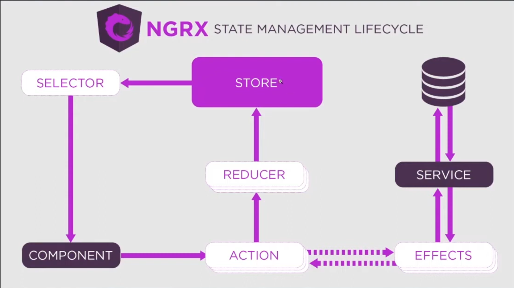

# o que é State Management? ( Gerenciamento de Estado )

O gerenciamento de estado em Angular envolve o armazenamento, atualização e recuperação de dados em um local centralizado, conhecido como `state container ou store`. Este armazenamento contém o estado do aplicativo e fornece métodos para interagir com ele.

## Arquitetura do NGRX que utiliza State Management como core.

