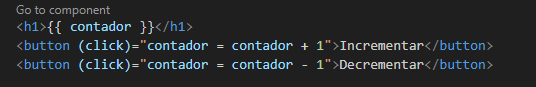
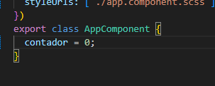
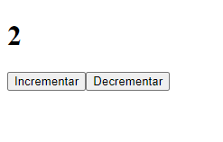
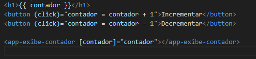
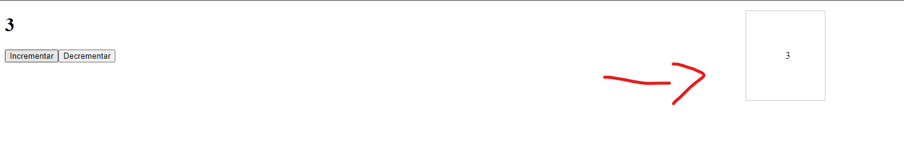

# Para que serve o gerenciamento de estados?

- Bom, imagine que você esteja dentro de `app.component.html`, onde você tem a seguinte estrutura
- 

- e dentro do seu `app.component.ts` você tenha um `contador = 0;`
- 
- aqui você já está gerenciando o estado do contador.
- quando clica em `Incrementar` ele adiciona + 1 ao contador
- quando clica em `Decrementar` ele decrementa - 1 ao contador
- ficaria assim:
  - 

---

- bem... agora imagine que esse mesmo contador você precisa passar para um outro componente que precisa dele, como no exemplo:
  - 
- percebe que minha fonte de verdade é sempre o `app.component.ts` que possui o contador? e ele que está passando para todas as outras dependencias?
- e se eu tiver uma arvore de componentes que dependem da mesma informação, vou precisar ficar passando via @Input ou @Output essa informação para que elas se atualizem?, podemos criar um serviço pra isso, mas essa não é a melhor forma, por isso vamos utilizar o NGRX para resolver esses problemas de controle de estado.

> **IMPORTANTE LEMBRETE** Você desenvolveu um sistema que tinha uma serie de dependencias da mesma fonte de dados exemplo: você fazia um get de fornecedores em um componente e mandava essa info para os outros componentes via Output para informar que receber os fornecedores e via Input para adicionar nos outros componentes que dependiam dessa informação, isso se torna totalmente trabalhoso e cria um vinculo desnecessário.

<!-- -  -->
