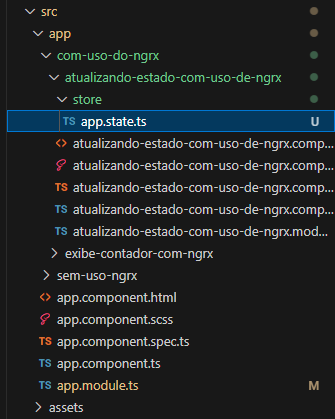
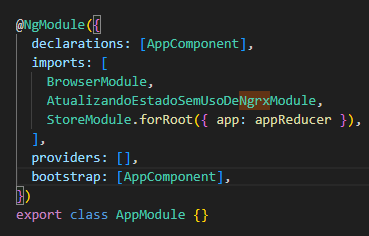
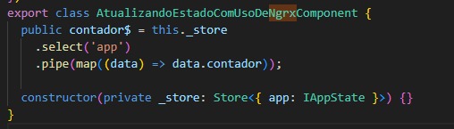
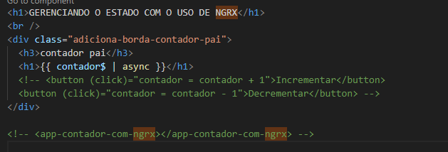
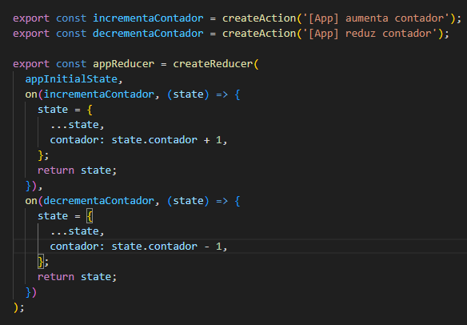
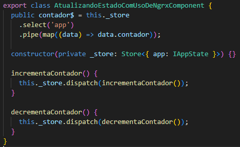
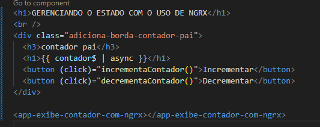
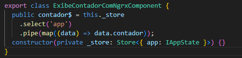
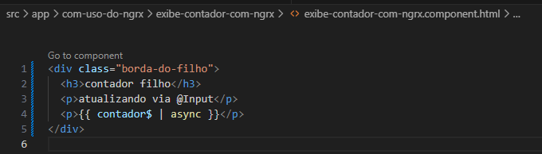

# Agora vamos botar a mão na massa

# Passo a Passo

## Criando mini infra improvisada

1. crie uma pasta chamada `store` dentro de `atualizando-estado-com-uso-de-ngrx`
2. vamos criar algo bem simples como `app.state.ts` apenas de exemplo, depois vamos melhorar toda a estrutura.
3. nossa estrutura simples vai ficar assim:
4. ;
5. dentro desse arquivo vamos definir uma interface para dizer qual será o contrato vigente desse nosso estado, no nosso caso é apenas:
   ```
   export interface IAppState {
     contador: number;
   }
   ```
6. agora vamos falar qual o estado inicial da nossa aplicação, exemplo:
   ```
   export const appInitialState: IAppState = {
     contador: 0,
   };
   ```

## Criando nossa Reducer

7. com a interface e o valor iniciar pre configurados, podemos criar nossa `reducer`
   ```
   export const appReducer = createReducer(appInitialState);
   ```
8. nossa reducer recebe um estado inicial como parametro que no nosso caso é o `appInitialState`

## Configurando nossa Reducer dentro de StoreModule

9.  agora temos que declarar no root da nossa aplicação o modulo de store do NGRX para poder gravar as alterações.
10. vá até app.module e adicione em `imports` o:

```
 StoreModule.forRoot({ app: appReducer });
```

- ficando assim:
- ;

11. no exemplo acima, eu defini um nome para o meu reducer, que eu escolhi ser app, porem imagina que fosse um controle de usuarios por exemplo, poderia chamar de usuarios nesse caso.

## Selecionando items da sua store

12. feita essa configuração agora vamos usar o Store do NGRX para selecionar essa informação
13. vá até o componente `atualizando-estado-com-uso-de-ngrx` exemplo:
14. 
15. 
16. o que mudou?
    1.  bom.. agora nosso contador virou um observable e estamos pegando direto do store esse dado, como o contador vem dentro de um objeto precisamos acessar esse objeto via map para retornar o valor desejado e estamos utilizando o pipe async no html para ele converter nosso observable para valor.
    2.  porem como agora armazenamos essa informação no store, conseguimos consultar ela de qualquer lugar.

## Criando actions

17. vá até o seu arquivo improvisado `app.state.ts`
18. e crie as actions que serão executadas para poder atualizar o contador
19. 
20. na imagem acima podemos observar que foram criadas duas actions a `incrementaContador` e a `decrementaContador`
21. após criada as actions devemos passar elas para o nosso `reducer`, informando qual ação e logo em seguida você vai fazer a lógica que ela vai realizar com base nesse target.
22. **IMPORTANTE** todo state da sua action precisa ser atualizado com ele mesmo, ou seja se você estiver atualizando um objeto por exemplo, ele vai ser

```
{
  ...state,
  // coisas q vc quer atualizar.
}
```

como no exemplo, eu primeiro atualizo o state recebendo ele mesmo e depois atualizo o que preciso que no caso foi o contador, pegando o estado anterior do contador e adicionando mais um a ele.

## Utilizando as actions

23. para utilizar as actions é bem simples, basta ir aonde vc deseja e dar um `.dispatch(NOME_DA_ACTION)`
    1.  
    2.  
    3.  
    4.  
24. e pronto depois de dar um .dispatch, e mandar atualizar via click
25. eu atualizei meu componente que exibe o contator pegando o valor lá de Store também
26. agora toda atualização que eu fizer quem estiver "ouvindo" o store de `app` vai receber a atualização do valor
