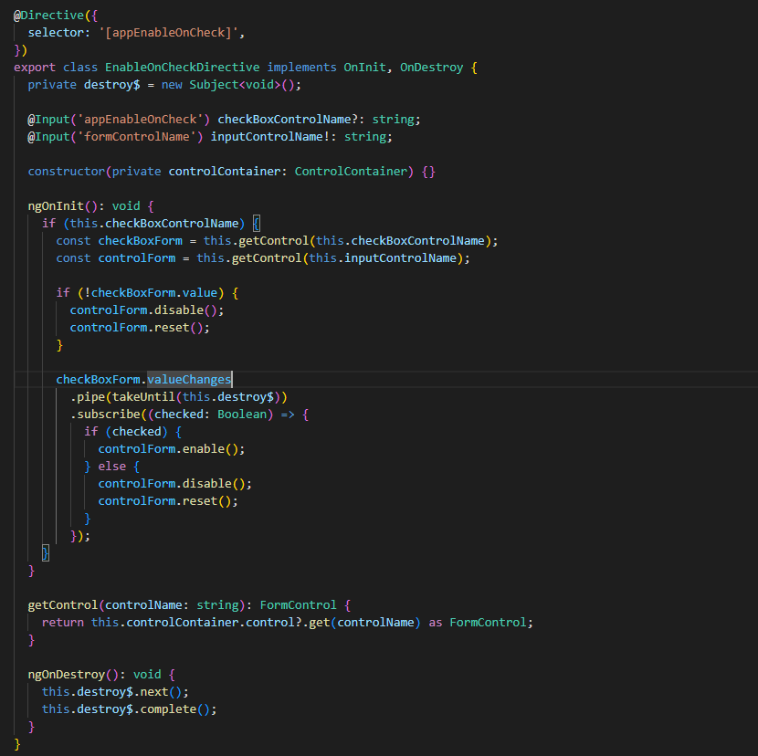

## O que é uma Diretiva?

É uma classe do angular responsável por adicionar comportamentos extra nos elementos

Exemplo 1:

Preciso que em alguns lugares da tela quando passa o mouse por cima fique amarelo, podemos criar uma diretiva com esse comportamento, ao inves de pegar cada lugar da tela e adicionar um hover amarelo.

Exemplo 2:

Podemos criar diretivas para lidar com comportamentos, vamos supor que precisamos que ao clicar em um checkbox,
ele deve desativar um determinado formControl, podemos fazer esse comportamento com diretiva e replica-lo para
outros cenários caso tenha.

Exemplo 3:
