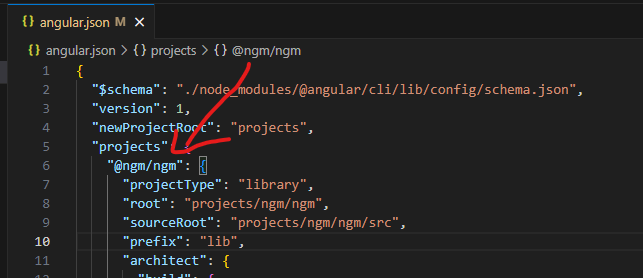

# Criando sua primeira Library em Angular.

**PROJETO DE EXEMPLO:** https://github.com/spyrado/ngm-lib

## Como criar a lib?

1. `ng new ngm-lib --no-create-application`
2. `cd ngm-lib`
3. `ng generate library @ngm/ngm`
4. vá até `angular.json` e adicione esse código abaixo de `"projectType"`
   1. código:
      ```
        "schematics": {
          "@schematics/angular:component": {
            "style": "scss"
          }
        },
      ```
   2. isso vai permitir que seu projeto gere novos arquivos como `.scss` e não css.
5. deixe apenas o `ngm.module.ts` dentro da pasta `projects\ngm\ngm\src\lib` o resto apague tudo.
6. gere um componente de teste a partir da sua pasta de workspace(ngm-lib) com o comando:
   1. `ng g m button --project=@ngm/ngm`
   2. `ng g c button --project=@ngm/ngm`
   3. entre dentro de `button.module` e export o componente `exports: [NgmButtonComponent]`
   4. o nome desse projeto é `@ngm/ngm` mas se quiser<br>
      identificar qual o nome do seu projeto é só seguir a imagem:
   5. 
7. procure o seu arquivo `public-api.ts` e exporte o botão `export * from './lib/button/button.module';`

## Como criar uma aplicação para TESTAR A LIB?

8. entre na pasta `cd ngm-lib`
9. `ng g application teste`
10. rode o comando `npm run watch` no `package.json` ("watch": "ng build --watch --configuration development")
11. ele vai ficar ouvindo mudanças q vc fizer na lib.
12. rode o comando `npm run start`
13. ele vai iniciar o servidor da aplicação `teste` que acabamos de criar
14. entre no `app.module`
15. insira o NgmModule dentro de `imports`
16. remova todo o conteudo de `app.component.html` e insira a tag `ngm-button`
