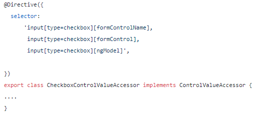

# Como criar formulários customizados?

Link ref: [angular-custom-form-controls](https://blog.angular-university.io/angular-custom-form-controls/)

Hoje vamos aprender como criaremos formulários customizaveis compatíveis com ReactiveForms e Template Driven forms

Podemos utilizar o form customizado com:
- **ngModel**
- **formControlName**
- **formControl**

## O que é Control Value Acessor?
---
<br>

É uma classe em que as diretivas de formControlName por exemplo, utiliza para pegar rastrear o valor do campo e comunicá-lo de volta ao formulário pai.

<br>

## O que siginifica cada metodo implementado por ele?
---
<br>

- **writeValue:** Esse método é chamado pelo Forms module para escrever/inserir um valor dentro do form control
  <br>
  O método ```writeValue``` é chamado pelo módulo de formulários Angular sempre que o formulário pai deseja definir um valor no controle filho.
- **registerOnChange:** Quando um valor de formulário é alterado devido à entrada do usuário, precisamos relatar o valor de volta ao formulário pai. Isso é feito chamando um callback, que foi registrado inicialmente com o controle usando o método registerOnChange
- **registerOnTouched:** Quando o usuário interage pela primeira vez com o controle de formulário, considera-se que o controle tem o status tocado, o que é útil para estilizar. Para relatar ao formulário pai que o controle foi tocado, precisamos usar um retorno de chamada registrado usando o método registerOnToched
- **setDisabledState:** controles de formulário podem ser habilitados e desabilitados usando a API Forms. Este estado pode ser transmitido para o controle de formulário através do método setDisabledState

<br>

## Porque não precisamos implementar a interface ControlValueAccessor para inputs simples?
---
<br>

O modulo de Forms do angular por padrão já cobre todos os forms simples com sua diretiva interna, veja um exemplo:



Isso significa que qualquer outro tipo de formulário mais elaborado, precisamos implementar o nosso próprio ```ControlValueAccessor```

***IMPORTANTE:*** Ao implementar a interface ```ControlValueAccessor```, ela te dará 3 metodos: ```writeValue```,
```registerOnChange``` e ```registerOnTouched```, esses metodos só podem ser utilizados pelo componente e ou diretiva que está implementando esse metodo, componente pai NÃO PODE utilizar esses metodos, pq eles são de uso de callback do framework
