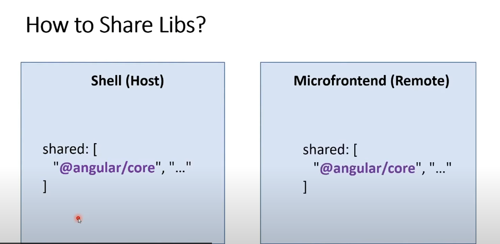

# Qual a vantagem de se utilizar module federation?

1. Imagina que você tem uma aplicação que tem 10 MFE dentro dela
   - se fosse com custom elements, ele carregaria 10x o angular o bootstrap e etc
   - porem com module federation você pode dar um share no @angular/core /common e bootstrap e qualquer dependencia
   - que de para compartilhar entre 1 ou mais projetos
   - fazendo com que aquela dependencia carregue apenas uma vez.
   - segue uma imagem exemplo:
   - 