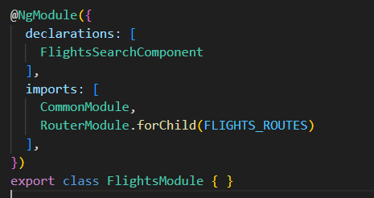

# Criando componente no MFE e expondo no Chassi(shell)

1. crie o modulo FlightsModule e o componente FlightsSearchComponent
   - cd workspace
   - ng g m flights --project=mfe1
   - ng g c flights/flights-search --project=mfe1
2. dentro do FlightsModule insira o FlightsSearchComponent dentro de  `declaration`
   - sua estrutura deve ficar assim: 
     - 
3. adicione o `FlightsModule` nos `imports` do app.module.ts
4. crie uma rota para carregar o FlightsSearchComponent
   - dentro da pasta `flights` adicione o arquivo `flights.routes.ts`
   - insira essa rota:
      ```
      import { Routes } from "@angular/router";
      import { FlightsSearchComponent } from "./flights-search/flights-search.component";

      export const FLIGHTS_ROUTES: Routes = [
        {
          path: 'flights-search',
          component: FlightsSearchComponent
        }
      ];
      ```
    - agora injete a rota criada no seu modulo:
    - `RouterModule.forChild(FLIGHTS_ROUTES)`
    - deve ficar igual na imagem 
    - 
5. agora vamos deixar o modulo(`FlightsModule`) visivel para que o shell tenha acesso a ele.
   - para deixar visivel devemos ir até `mfe1/webpack.config.js`
   - primeiro remova o pre-definido dentro de `exposes` ( caso tenha )
      - `'./Component': './projects/mfe1/src/app/app.component.ts',`
   - e adicione dentro de `exposes` esse trecho:
     - ```
        exposes: {
          './Module': './projects/mfe1/src/app/flights/flights.module.ts',
        },
       ```
    - deve ficar assim: 
      - 
    - a configuração feita em exposes faz com que `FlightsModule` fique visível com o nome de `Module`
    - e a seção shared aponta para o chassi(shell)