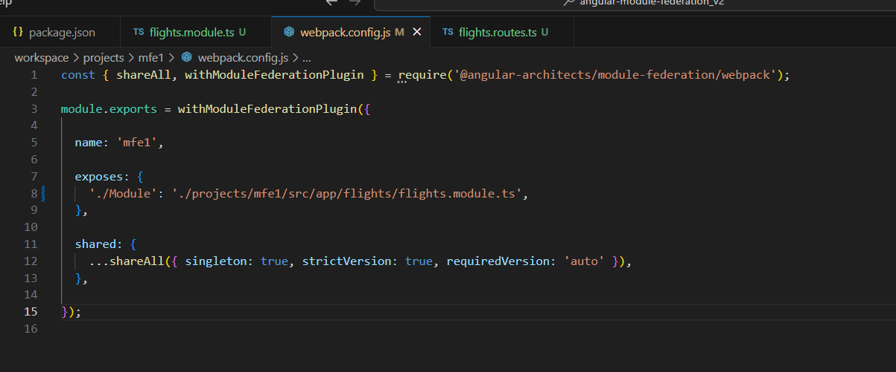

# Linkando o Chassi(shell) com o mfe1

1. primeiro de tudo para criar esse apontamento vamos ter que criar uma rota para quem precisamos chamar, que no caso é o `Module` que criamos no step anterior que contem o `FlightsModule` para relembrar segue uma foto:
    - 
2. criando o lazy loading no chassi chamando o `Module`
   - entre em `projects/shell/src/app/app-routing.module.ts`
   - cole o código abaixo
      ```
        import { NgModule } from '@angular/core';
        import { RouterModule, Routes } from '@angular/router';

        const routes: Routes = [
          {
            path: 'flights',
            loadChildren: () => import('mfe1/Module').then(m => m.FlightsModule)
          },
        ];

        @NgModule({
          imports: [RouterModule.forRoot(routes)],
          exports: [RouterModule]
        })
        export class AppRoutingModule { }
      ```
    - aqui estamos importando o `/Module` e falando que ele vem do `mfe1` (mais pra frente vamos cadastrar o `mfe1` para que ele entenda de fato oq é esse `mfe1` por enquanto ele é só um nome qualquer).
    - porem esse é apenas um caminho virtual o typescript não sabe que ele existe, então temos que dar um bypass no ts
    - dentro de /app do shell crie um arquivo chamado decl.d.ts e coloque isso dentro:
      -  `declare module 'mfe1/Module';`
    - e pronto o compilador do typescript vai parar de dar erro.
3. cadastrando o nome `mfe1` como caminho base para chamar o `/Module` para que quando eu importe
   `import('mfe1/Module')` ele emtemda de onde vem esse `mfe1` o `/Module` ele já está cadastrado no nosso projeto `mfe1` expondo o componente como mostra na primeira imagem.
   - para cadastrar vá até `projects/shell/webpack.config.js` e dentro de `remotes` cadastre o caminho base e aponte para qual `mfe` esse caminho base vai referenciar.
   - dentro de `projects/shell/webpack.config.js` cole:
      ```
      const { shareAll, withModuleFederationPlugin } = require('@angular-architects/module-federation/webpack');

      module.exports = withModuleFederationPlugin({

        remotes: {
          "mfe1": "http://localhost:4201/remoteEntry.js",
        },

        shared: {
          ...shareAll({ singleton: true, strictVersion: true, requiredVersion: 'auto' }),
        },

      });

      ```
    - estou dizendo que o MicroFront que está rodando na porta 4201 vai ter a referencia dentro do projeto como `mfe1` e tudo que está dando expose dele no meu chassi eu posso importar com `loadChildren: () => import('CAMINHO_BASE_REMOTES_CHASSI/CAMINHO_BASE_EXPOSES_NO_MFE').then(m => m.FlightsModule)`
4. PARA FINALIZAR vamos ver isso rodando e funcionando na prática
5. vá até o seu app.component.html e remova tudo deixe apenas o `<router-outlet></router-outlet>`
6. agora no seu `package.json` rode o `"run:all"` que ele vai executar os dois projetos ao mesmo tempo
7. e pronto, você vai ver algo como
   
     - explicando a foto:
       - meu CHASSI(SHELL) está rodando na porta 4200 e chamando a rota `http://localhost:4200/flights/flights-search`
       - quando eu chamo a rota `/flights-search` ele chama meu `componente` que expus lá no `mfe1`
       - e ai carrega o componente ^^