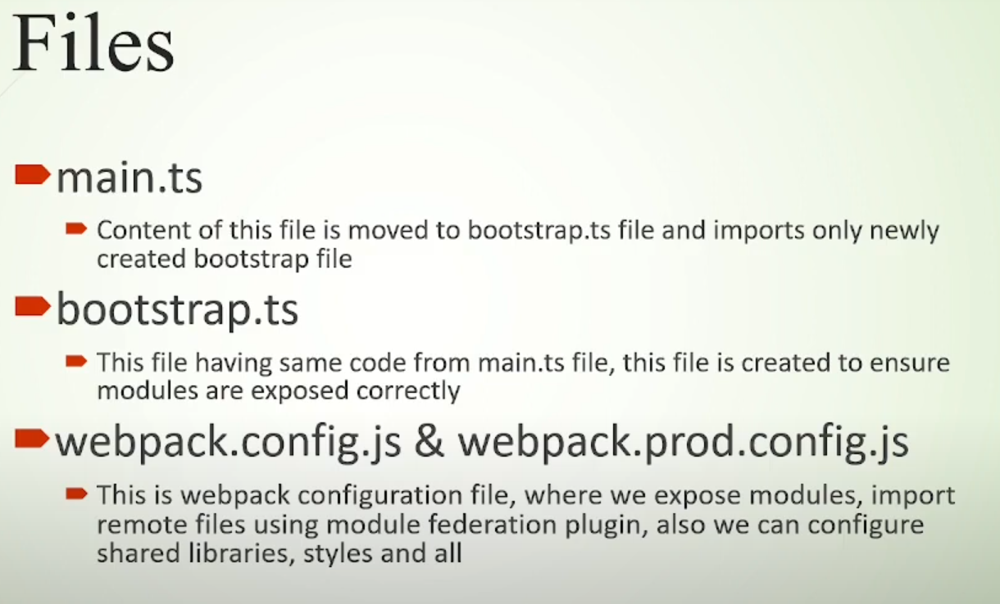

# Module Federation Usando WorkSpace

## Nesse tutorial vou criar essa estrutura utilizando module federation

```
  workspace
  │
  └───projects // gera essa pasta automaticamente quando começa a criar as aplicações ( ng g application XPTO )
  │ │
  │ └───host-app // representa a aplicação base
  │ └───products-app // MFE1
  │ └───orders-app // MFE2
  │ └───carts-app // MFE3
```

## Como gerar essa estrutura de pastas?

Bem simples, siga esse passo a passo

1. crie uma pasta simples, exemplo: `mkdir angular-module-federation`
2. dentro dela digite `ng new workspace --create-application false`
3. `cd workspace`
4. agora vamos criar as aplicações
5. digite: `ng g application host-app`
6. digite: `ng g application products-app`
7. digite: `ng g application orders-app`
8. digite: `ng g application carts-app`
9. e pronto temos a estrutura de pastas.

## Instalando Bootstrap ( como exemplo apenas do potencial do module federation )

1. instale na raiz do projeto
2. `cd angular-module-federation`
3. `npm install bootstrap`

## Instalando Module Federation

1. entre no root da sua aplicação, que nesse caso é `cd angular-module-federation`
2. crie um module federation para cada aplicação, seguindo esses comandos:
3. `ng add @angular-architects/module-federation --project host-app --port 5000`
4. `ng add @angular-architects/module-federation --project orders-app --port 4000`
5. `ng add @angular-architects/module-federation --project products-app --port 3000`
6. `ng add @angular-architects/module-federation --project carts-app --port 2000`

## Gerando um componente para products-app

1. `cd angular-module-federation`
2. `ng g m products --route products --module app.module --project products-app`

## Comandos

- cria um `workspace` com node_module e todos os arquivos de configuração do angular removendo a pasta src/app
  - `ng new NOME_DO_SEU_WORKSPACE --create-application false`
- cria uma aplicação dentro do meu `workspace` em `workspace/projects/NOME_DA_MINHA_APLICACAO`.
  - `ng g application NOME_DA_MINHA_APLICACAO`
- para startar um servidor de um projeto voce pode fazer assim:
  - `cd workspace`
  - `ng s host-app`

## IMAGENS:

arquivos iniciais de configuração:


