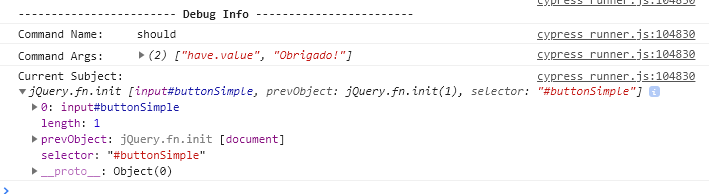
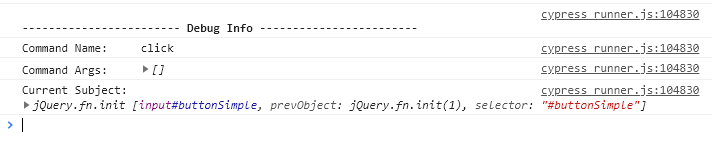

# Cypress

## Início

npm install cypress -> instala o cypess
  cypress open -> roda o cypress

`/// <reference types="Cypress" />` -> adicione essa linha no começo de um arquivo `nome_arquivo.spec.js` para o vs code<br> entender que estamos trabalhando com cypress

<br/>

---

<br/>

## DEBUG

Utilize o debug, para entender mais sobre o que ocorre.
> **Nota:** Após abrir o inspecionar e cair no ponto de debug só de o play( deixe passar o debug ), e vai aparecer<br>
> um log do que ocorreu, segue exemplo:

`cy.get('#buttonSimple').should('have.value', 'Clique Aqui').debug();` -> com o debug no `should` ele vai abrir infos sobre oq ocorreu no `should`<br>



`cy.get('#buttonSimple').click().debug().should('have.value', 'Clique Aqui');` -> com o debug no `click` ele vai abrir infos sobre oq ocorreu no `click`<br>



<br/>

---

<br/>

## PAUSE

O comando `.pause()` ele serve como um debugger, porem nós conseguimos ver o passo a passo do que está ocorrendo,<br>
podemos dar um `next step` na ferramenta ai iremos acompanhar passo a passo do comportamento da ferramenta.

> **Nota:** Se os comandos estiverem aninhados eles serão executados de uma vez e você não vai conseguir dar um <br> 
> `next step` entre eles para isso vc pode durante a analise, separar esse `aninhamento`.

#### Exemplo de aninhamento: 

```
  cy.pause();
  cy.title()
    .should('be.equal', 'Campo de Treinamento')
    .and('contains', 'Campo');
```

#### Exemplo do funcionamento do pause:

O comando abaixo vai dar um pause antes de executar os 2 outros comandos, ai `na ferramenta` eu posso dar um `next`<br>
ai ele vai cair nessa primeira validação: `cy.title().should('be.equal', 'Campo de Treinamento');`<br>
e depois eu posso dar outro `next` ai ele cai na proxima validação (`cy.title().should('contains', 'Campo');`) e por ai vai

```
  cy.pause();
  cy.title().should('be.equal', 'Campo de Treinamento');
  cy.title().should('contains', 'Campo');
```

<br/>

---

<br/>

## Asserts

  Podemos fazer de algumas formas umas menos intuitivas como:<br>
  
  Todas abaixo tem o mesmo resultado, o que muda é a leitura, e na minha opiniao `to be equal` seria o ideal nesse caso
  
`expect(1).equal(1);` -> vai dar o mesmo resultado<br>
`expect(1).to.equal(1);` -> vai dar o mesmo resultado<br>
`expect(1).to.be.equal(1);` -> vai dar o mesmo resultado

<br/>

---

<br/>

## Asserts para objetos

`expect(obj).to.be.deep.equal({ a: 1, b: 2 });` -> `.deep` Verifica TODAS as propriedades dentro do objeto<br>
`expect(obj).eql({ a: 1, b: 2 });` -> é um shortcut do comando a cima <br>
`expect(obj).include({ a: 1);` -> Verifica se EXISTE AQUELA PROPRIEDADE/VALOR dentro daquele objeto 

  ```

    it('Equality for Objects', () => {
  
    const obj = {
      a: 1,
      b: 2
    };
    // essa é uma forma errada, pq o js entende que é outro objeto outra referencia, para isso devemos utilizar deep
    // expect(obj).to.be.equal({ a: 1, b: 2 }); // ERRADA
      expect(obj).to.be.deep.equal({ a: 1, b: 2 }); // CERTA
      expect(obj).eql({ a: 1, b: 2 }); // SHORTCUT DE DEEP
      expect(obj).include({ a: 1 }); // VERIFICA SE EXISTE AQUELA PROP/VALUE DENTRO DO OBJ
    });

  ```

<br/>

---

<br/>

## Asserts para Arrays

`expect(array).to.be.members([1,2,3]);` -> Deve possuir exatamente os mesmos numeros<br>
`expect(array).to.include.members([1,3]);` -> Deve ter esses numeros dentro do array.<br>
`expect(array).not.to.be.empty;` -> Nao deve estar vazio<br>
`expect([]).to.be.empty;` -> Deve estar vazio<br>
`expect([]).length(0);` -> variação de implementacao do deve estar vazio<br>
`expect([1,2]).length.greaterThan(0);` -> deve ser maior que 0<br>

<br/>

---

<br/>

## Asserts para ELEMENTOS HTML

`cy.get('#buttonSimple').should('have.value', 'Clique Aqui');` -> pelo `have.value` eu verifico o texto do botão

<br/>

---

<br/>

## ASYNC

Trabalhando com coisas asyncronas no cypress, uma delas é pegar o título de uma página, exemplo:

Se eu digitar:<br>
`cy.visit('url_da_pagina');` e logo após isso digitar:<br>
`cy.title()` vai dar erro, pois ele retorna uma função "encadeada"(`chained`) e para testar funções encadeadas utilizamos o `should`, segue um exemplo:<br>
`cy.title().should('be.equal', 'Campo De Treinamento');` ele é igual a um `expect` só que um pouco diferente.

Mas o cypress nos preparou um metodo chamado should,

```
it('should visit a page and assert a title', () => {
  cy.visit('https://wcaquino.me/cypress/componentes.html');
  cy.title().should('be.equal', 'Campo');
});
```

<br/>

---

<br/>

## SHOULD

> **Nota:** o `should` pode ser utilizado encadeado, ou seja eu posso fazer algo como: 
```
cy.title()
  .should('be.equal', 'Campo de Treinamento')
  .should('contains', 'Campo');
```

> **Nota:** mas para deixarmos um pouco mais legível utilizamos `and` no lugar do segundo should para mais, segue exemplo:

```
cy.title()
  .should('be.equal', 'Campo de Treinamento')
  .and('contains', 'Campo');
```

> O should ele cria uma assertiva, e assertivas são automaticamente retentadas durante um periodo de tempo e a condição 
para elas pararem de ser retentadas é caso de sucesso na acertiva ou o tempo delas acabem ( geralmente o padrão é 4 segundos de retentativa ).

`CENÁRIO 1:` No exemplo abaixo se o titulo for diferente de Campo De Treinamento, ela vai executar por 4 segundos e somente depois vai disparar um erro.<br>
`CENÁRIO 2:` Agora se no exemplo abaixo o título for igual ela vai executar até que obtenha a informação do título.

`RESULTADO CENÁRIO 1:` O tempo de execução demorou 4 segundos, pois não existia aquele título e o should ficou reexecutando até dar o tempo de timeout( que são 4 segundos ) <br>
`RESULTADO CENÁRIO 2:` O tempo de execução demorou 0.35 segundos, pois o título inserido era exatamento o esperado.


`cy.title().should('be.equal', 'Campo De Treinamento');` 