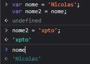

# Objeto de Referencia e Cópia

Link de Referência: [Object Reference](https://javascript.info/object-copy)

## Variáveis primitivas
-----
<br>
Variáveis com valores primitivos sempre tem o seu valor copiado de forma a não ter referencia.
exemplo:

<br>



Na imagem acima vemos que temos duas variáveis ( ```NOME``` e ```NOME2``` ), sendo que ```NOME``` é passado como referencia para ```NOME2```, porem quando alteramos ```NOME2``` para qualquer outra string, a variavel ```NOME``` continua intácta, isso já não acontece 
com Objetos, acontece apenas com variaveis do tipo primitiva ( string, number, boolean e etc.. )

<br>

## Variáveis do tipo Objeto
-----

Já com variáveis do tipo objeto ao você atribuir ela a outra variável, ela pega o endereço de memória ( referência ) dessa variável e não o seu conteúdo,
ou seja toda vez que você alterar uma variável que pegou uma referencia de outro objeto, esse objeto pai sempre será modificado também, ***você deve ficar atento a isso***.

Segue um exemplo de como isso afeta o código:

<br>


Aqui conseguimos observar que a variavel ```obj``` foi declarada com a propriedade ```nome = 'Nicolas'```, porem ao passar a variavel ```obj``` para a outra variavel ```obj2``` e na variável ```obj2``` alterarmos a propriedade ```nome``` para ```xpto```, o ```obj``` também é afetado com essa alteração, ficando tanto ```obj``` quanto ```obj2``` com a propriedade ```nome``` igual a ```xpto```.

<br>

## Como resolver esse problema?

<br>

### Solução 1

<br>

Quando nos deparamos com esse tipo de situação devemos utilizar alguns recursos nativos do JavaScript para resolver isso, segue a solução;

<br>


Na imagem acima utilizamos a estratégia de transformar o Objeto em um JSON isso faz com que o javascript desvincule a referencia, e transformamos o JSON em objeto para o javascript trabalhar normalmente como objeto.

```JSON.parse(JSON.stringify(obj));```

<br>

### Solução 2

<br>

Podemos também utilizar a classe nativa ```Object``` do JS, e dar um ```assign```, o assign pegar todas as props do objeto source e passa para um target q vc desejar, nesse exemplo, eu defino o target como vazio, e passo o objeto que quero copiar como source,
e assim eu crio um objeto novo para minha variavel ```obj2```, sem dependencias de ```obj```

```
var obj = {nome: 'Nicolas'}
var obj2 = Object.assign({}, obj);
```

### Solução 3

<br>

Podemos também utilizar o ```Spread Operator```, que é uma solução mais moderna, que basicamente você fala para o js que quer pegar tudo dentro do objeto e jogar dentro de algo, que nesse caso é outro objeto ```{...obj}``` segue o exemplo:

```
 var obj = { nome: 'Nicolas' }
 var obj2 = { ...obj };
```


