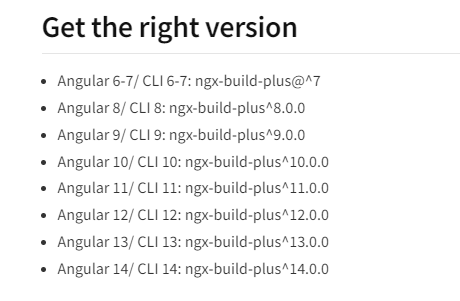

# Micro Front End Utilizando [Angular Elements]

Link ref: [implementando micro front utilizando angular elements](https://dzone.com/articles/scaling-micro-frontends-using-angular-elements)

## Como implementar?
---
 

## Passo 1
 

 1. Crie o seu projeto angular normalmente `ng new nome-do-seu-projeto --style=scss`
 2. Entre no projeto criado `cd nome-do-seu-projeto`
 3. Instale essa dependência que vai possibilitar a criação do micro: 
    1. `npm install @angular/element --save`
 4. mude o arquivo `package.json` para essa configuração:

    `"build":"ng build --prod --output-hashing=none",` 
    `"package":"cat dist/nome-projeto/{polyfills,runtime,main}.js > ./dist/nome-projeto/nome-do-seu-mfe.js",` 
    `"bundle":"npm run build && npm run package"`

    > `"build":"ng build --prod --output-hashing=none",`: Essa configuração vai fazer com que ele rode um build do micro front sem colocar HASH no arquivo 
    `"package":"cat dist/nome-projeto/{polyfills,runtime,main}.js > ./dist/nome-projeto/nome-do-seu-mfe.js"`: Essa configuração, 
    vai possibilitar pegar todos os `.js` gerados no build e jogar para um só `arquivo.js` . 
    `"bundle":"npm run build && npm run package"`: vai juntar as duas configs acima, primeiro vai gerar o `build` do microfront, e após isso vai pegar rodar o `package` que vai pegar os arquivos `.js` do build gerado e vai gerar um único `arquivo.js` 

 5. Vá até o app.module.ts e remova o `bootstrap: [ AppComponent ]`
 6. cole o código abaixo:

        export class AppModule {

          constructor(private injector: Injector) {}

          ngDoBootstrap() {
            const nomeDoSeuComponenteElement = createCustomElement(NOME_DO_COMPONENTE_MFE, { injector: this.injector });
            customElements.define('mfe-xpto', nomeDoSeuComponenteElement);
          }
        }
    > Como removemos o `bootstrap: [ AppComponent ]`, devemos inicializar a aplicação manualmente com um ciclo de vida
    do angular, chamado: `ngDoBootstrap` e dentro dele vamos utilizar os recursos que a lib `@angular/element` nos proporciona para criar o `MFE` 
    nessa linha: 
    &nbsp;&nbsp;&nbsp;&nbsp;`createCustomElement(NOME_DO_COMPONENTE_MFE, { injector: this.injector });` eu crio meu elemento customizavel. 
    e nessa linha: 
    &nbsp;&nbsp;&nbsp;&nbsp;`customElements.define('mfe-xpto', nomeDoSeuComponenteElement);` eu defino 
    o nome do componente, e passo como segundo parametro o componente que vai ter esse nome, ou seja sempre que eu quiser chamar o meu micro front em outra aplicação o nome que eu devo chamar é oq eu colocar no lugar de `mfe-xpto`.

  1. O seu `app.module.ts` deve ficar assim:

          import { Injector, NgModule } from '@angular/core';
          import { createCustomElement } from '@angular/elements';
          import { BrowserModule } from '@angular/platform-browser';

          import { NOME_DO_COMPONENTE_MFE } from './NOME_DO_COMPONENTE_MFE.component';

          @NgModule({
            declarations: [
              NOME_DO_COMPONENTE_MFE
            ],
            imports: [
              BrowserModule
            ],
          })
          export class AppModule { 

            constructor(private injector: Injector) {}

            ngDoBootstrap() {
              const nomeDoSeuComponenteElement = createCustomElement(NOME_DO_COMPONENTE_MFE, { injector: this.injector });
              customElements.define('mfe-xpto', nomeDoSeuComponenteElement);
            }
          }

<!-- - npm install ngx-build-plus --save **IMPORTANTE** ( a versão que você deve instalar deve ser a mesma do angular da aplicação, ou seja se seu angular é versão 10, você deve dar um  npm install ngx-build-plus@10.0.0 --save)

**@angular/element** -> vai te permitir a criar Web Components ( componentes que rodam em qualquer aplicação ( seja react, vue, angular ) )

**ngx-build-plus** -> vai fazer com que o build do angular gere apenas um bundle final .js
 se atente a versão correta antes de instalar o ngx
 -->

 

## Desvantagens de usar em específico Angular Elements
---
 

- Todo projeto feito com angular elements, gera um build todo de .js e .css, ou seja 
  se tivermos uma aplicação com uma lib bootstrap v4 e outra aplicação com bootstrap v5 ambas em micro front e caso o bootstrap mude a classe .container { } na versao v4 de .container {padding: 14px} para .container { padding: 20px; background: red; } na versao v5, nosso sistema será impactado com isso, então todos os micros devem estar alinhados para utilizarem as mesmas versões de libs de estilo.

- Outro ponto, cada micro gera um build, e suponhamos que ambos os micros tenham o bootstrap v5 como framework css, então todo build desses micros vao gerar as MESMAS CLASSES toda hora, ou seja é como se estivessemos colocando 2 arquivos bootstrap.min.css
no servidor.