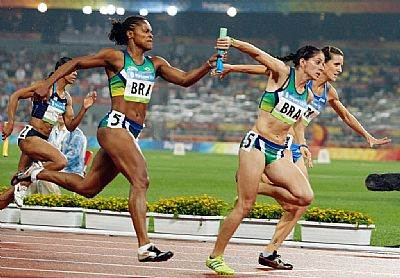
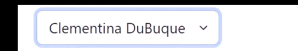
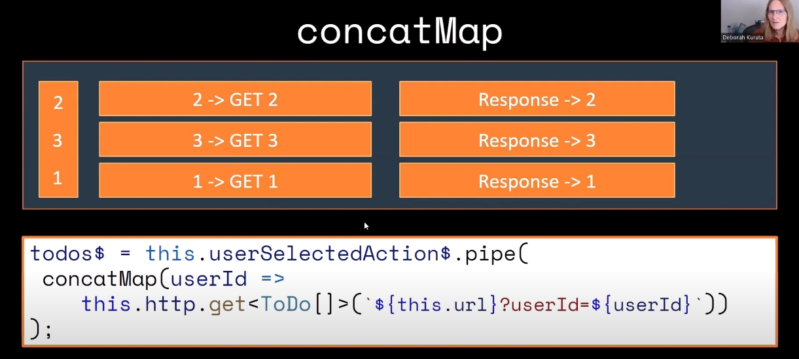

# Concat Map

`VIDEO REFERÊNCIA: ` https://www.youtube.com/watch?v=RSf7DlJXoGQ

O `concatMap` funciona como uma corrida de revezamento:
<br/>
  
<br/>
- ele sempre vai ser executado na ordem em que for recebido.
- o primeiro evento recebido sempre vai ser o primeiro a ser disparado como em uma fila.
- nunca o segundo evento vai ser emitido primeiro que o primeiro evento.

## Quando NÃO Utilizar concatMap? &cross;

### contexto: 

  O usuário selecionou o `item 2` depois o `item 3` e viu que na verdade ele queria o `item 1` da lista.




utilizar o `concatMap` nesse cenário é ruim pois:
  - ele vai fazer o request do `item 2` pegar o usuário x
  - somente depois que finalizar o `item 2` ele vai pegar o `item 3`
  - e somente depois que finalizar o `item 3` ele vai pegar o `item 1`.

mas o objetivo final do usuário era o item 1, o item 2 e o item 3 ele clicou sem querer.

## Quando utilizar concatMap? &check;

- Quando a ordem importar
- Quando você precisar processar uma a uma.
- exemplo:
  - quando você inserir, atualizar ou deletar.
  - você não vai querer atualizar algo que não foi inserido ainda.
  - você não vai querer deletar algo que não foi inserido ainda.

## Codigo de exemplo para voce testar o comportamento:

site para testar: https://stackblitz.com/edit/vkdudx?devtoolsheight=50&file=index.ts,index.html

```html
<select name="" id="select" (change)="onSelectChange($event)">
  <option value=""></option>
  <option value="11111">teste1</option>
  <option value="22222">teste2</option>
  <option value="33333">teste3</option>
</select>

```

```typescript 
import {
  concatMap,
  delay,
  forkJoin,
  from,
  fromEvent,
  map,
  mergeMap,
  of,
  switchMap,
tap,
} from 'rxjs';

// Obtém o select element
const selectElement = document.getElementById('select');

// Cria um Observable usando RxJS a partir do evento 'change'
const selectChange$ = fromEvent(selectElement, 'change');

let callCount = 0;

selectChange$
  .pipe(
    map(event => event.target.value),
    concatMap(value => {
      callCount++;
      let calculatedDelay;

      // Ajusta o delay baseado no número de seleções feitas
      if (callCount === 1) {
        calculatedDelay = 3000; // Primeiro delay maior
      } else if (callCount === 2) {
        calculatedDelay = 2000; // Segundo delay menor
      } else {
        calculatedDelay = 1000; // Terceiro delay menor ainda
      }

      // const newValue = JSON.parse(JSON.stringify(event.target.value));
      const print = `ssssss: ${value}`; 
      console.log(`Processando evento ${value} com delay de ${calculatedDelay}ms`);
      return of(print).pipe(
        delay(calculatedDelay),
        tap(() => console.log(`Evento ${value} exibido`))
      );
    })
  )
  .subscribe(result => {
    console.log(result);
    // Aqui você pode realizar outras ações com o valor selecionado
  });
```