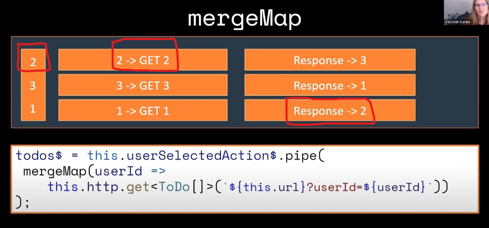

# Merge Map

`VIDEO REFERÊNCIA: ` https://www.youtube.com/watch?v=RSf7DlJXoGQs

O `mergeMap` funciona como uma corrida de 800 metros:


Todos vão sair ao mesmo tempo, uns podem sair em primeiro, outros em segundo, mas não significa que sempre oq sair primeiro vai finalizar a corrida em primeiro.

### Como no exemplo abaixo:



O usuário selecionou a `SEGUNDA OPÇÃO` foi feito o request logo em seguida da `SEGUNDA OPÇÃO`,
porem ela foi a última a dar a resposta, pois a carga do request 2 é maior que os demais.

Logo em seguida o usuário selecionou a `TERCEIRA OPÇÃO` e a terceira opção veio a resposta mais rapido.

## Quando NÃO Utilizar mergeMap? &cross;

  - não devemos utilizar `mergeMap` nesse caso, pois se o usuário selecionar a `opção 1` depois a `opção 2` e depois a `opção 3` como o merge map ele simplesmente dispara a primeira requisição que chega e não aguarda ela finalizar, vamos ter um problema ai, pois se a ultima opção que o usuário selecionar for a 3, mas a opção 1 for a mais demorada, o ultimo retorno vai ser da opção 1 sobrescrevendo o resultado selecionado pelo usuário que foi 3.

## Quando utilizar mergeMap? &check;

  - Quando as emissões/eventos puderem ser processadas de simultanea ( muitas vezes mais performático )
  - quando a ordem não importar.

## Codigo de exemplo para voce testar o comportamento:

site para testar: https://stackblitz.com/edit/vkdudx?devtoolsheight=50&file=index.ts,index.html

```html
<div>
  <label for="options">Escolha uma opção:</label>
  <select id="options">
    <option value="">escolha uma opção</option>
      <option value="1">Opção 1</option>
      <option value="2">Opção 2</option>
      <option value="3">Opção 3</option>
  </select>
</div>

<div>
  <h3>Resultado Atual:</h3>
  <div id="result"></div>
</div>

<div>
  <h3>Histórico de Chamadas:</h3>
  <ul id="history"></ul>
</div>

```

```typescript 
import { fromEvent, of } from 'rxjs';
import { mergeMap, delay } from 'rxjs/operators';

// Função para simular requisições com diferentes tempos de resposta
function simulateAsyncOperation(value: string) {
    let simulatedDelay: number;

    switch (value) {
        case '1':
            simulatedDelay = 3000; // 3 segundos
            break;
        case '2':
            simulatedDelay = 1000; // 1 segundo
            break;
        case '3':
            simulatedDelay = 2000; // 2 segundos
            break;
        default:
            simulatedDelay = 1000;
    }

    return of(`Resultado para opção ${value} (demorou ${simulatedDelay / 1000} segundos)`).pipe(
        delay(simulatedDelay)
    );
}

// Seleciona os elementos necessários
const selectElement = document.getElementById('options') as HTMLSelectElement;
const resultDiv = document.getElementById('result');
const historyList = document.getElementById('history');

// Cria um observable para o evento de mudança (change) no <select>
const selectChange$ = fromEvent<Event>(selectElement, 'change');

// Usa mergeMap para processar as mudanças do select
selectChange$.pipe(
    mergeMap(event => {
        const selectedValue = (event.target as HTMLSelectElement).value;
        return simulateAsyncOperation(selectedValue);
    })
).subscribe(result => {
    // Atualiza o resultado atual
    resultDiv!.textContent = result;

    // Adiciona o resultado ao histórico
    const listItem = document.createElement('li');
    listItem.textContent = result;
    historyList!.appendChild(listItem);
});

```