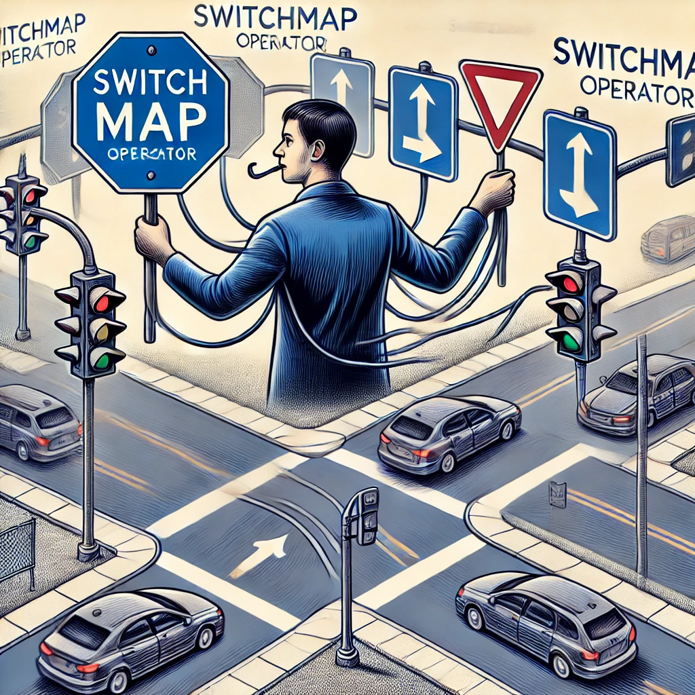

# switchMap

`VIDEO REFERÊNCIA: ` https://www.youtube.com/watch?v=RSf7DlJXoGQ

O `switchMap` funciona como um controle de tráfego:
<br/>

<br/>
- ele sempre vai cancelar a operação anterior e mudar para uma nova operação.
- O `switchMap` mapeia cada valor de um fluxo para um novo fluxo e cancela o fluxo anterior assim que um novo valor chega, garantindo que apenas o resultado mais recente seja processado.

## Quando NÃO Utilizar switchMap? &cross;

  - quando você precisar executar operações simultaneas

## Quando utilizar switchMap? &check;

- quando apenas o ultimo resultado importar

## Codigo de exemplo para voce testar o comportamento:

site para testar: https://stackblitz.com/edit/vkdudx?devtoolsheight=50&file=index.ts,index.html

```html
<div>
  <label for="input">Digite algo:</label>
  <input type="text" id="input" />
</div>
<div id="result"></div>

```

```typescript 
import { fromEvent, of } from 'rxjs';
import { switchMap, map, debounceTime, delay } from 'rxjs/operators';

// Simula uma requisição fake retornando um observable após um atraso
function fakeRequest(query: string) {
    console.log(`Iniciando requisição para: ${query}`);
    return of(`Resultado para "${query}"`).pipe(
        // Simula um atraso de 2 segundos
        delay(2000)
    );
}

// Seleciona os elementos da página
const inputElement = document.getElementById('input') as HTMLInputElement;
const resultElement = document.getElementById('result') as HTMLElement;

// Cria um observable para o evento de input
fromEvent(inputElement, 'input')
    .pipe(
        // Extrai o valor do input
        map(event => (event.target as HTMLInputElement).value),
        // Usa switchMap para cancelar a requisição anterior e iniciar uma nova
        switchMap(query => fakeRequest(query))
    )
    .subscribe(result => {
        resultElement.textContent = result;
    });

```

Nesse código não importa o que você digitar, será logado no final apenas o ultimo evento mandado,
se você digitou 1234 apagou e digitou 555 ele vai logar 555 se vc digitou sem parar qualquer coisa por 2 segundos e parar de digitar ele vai logar a sua ultima sequencia.