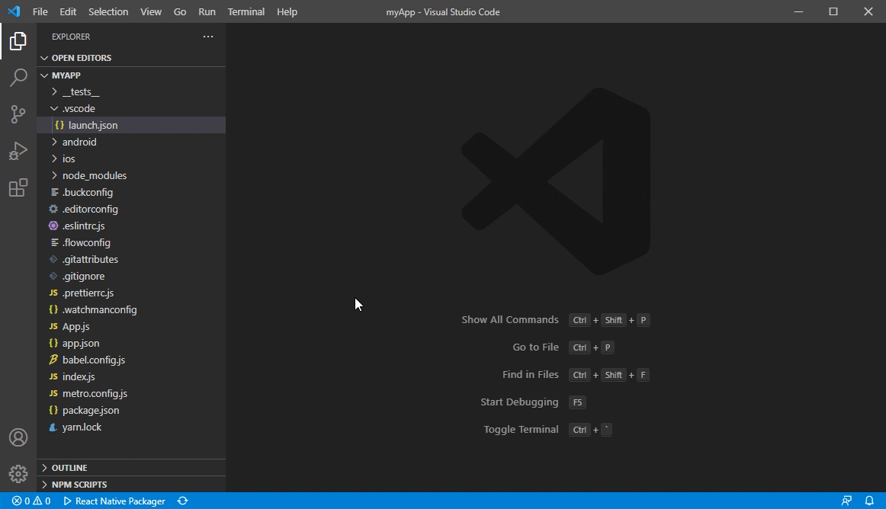
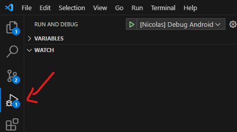
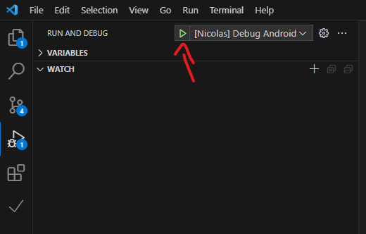

# Como criar uma aplicação React?
<br>

Com a ultima versão:

> npx react-native@latest init AwesomeProject

Ou com uma versão específica 

> npx react-native@X.XX.X init AwesomeProject --version X.XX.X 
> 
<br>

# Como iniciar sua aplicação Android?
<br>

1. > npx react-native start
2. > npx react-native run-android

<br>

# Como limpar o cache do seu aplicativo?
<br>

> npm start -- --reset-cache

<br>

# Como DEBUGGAR (DEBUG) sua aplicação?

<br>

> Video de referência: https://www.youtube.com/watch?v=FmomKgqYSoA

Temos um conjunto de ferramentas para te ajudar nisso segue cada uma delas e suas especialidades:

- **[EXTENSAO:React Native Tools]:** 
  - Permite você colocar `breakpoints` dentro do código no `vs code`
    - SIGA EXATAMENTE ESSES PASSOS PARA QUE FAÇA FUNCIONAR:
      1. RODE: `npm start` para iniciar o metro
      2. Configure o seu debugger seguindo esse tutorial: https://marketplace.visualstudio.com/items?itemName=msjsdiag.vscode-react-native#debugging-react-native-applications <br>
      **Recomendo mudar o name** de "Debug android" para "[Nicolas] Debug Android"
      
      3. Com o debugger configurado, clique na aba de `Run and Debug no vs code`
      
      4. Clique no botão para `startar o debug`
      
      5. Aguarde o app inicializar e habilite o modo debug no app CTRL+M e depois clique em debug
      5. Coloque um `breakpoint` em algum lugar do código e faça algo no app para que caia no `breakpoint`
      6. e pronto você agora consegue debugar pelo `VS Code`

      <br>

- **[REACT-DEVTOOLS](https://www.npmjs.com/package/react-devtools/v/4.28.0):** 
  - Rode o comando: `npm install -g react-devtools`
  - Em alguns casos precisa rodar um comando antes de iniciar o `react-devtools` (no meu caso atual precisa), caso precise rode esse comando: `adb reverse tcp:8097 tcp:8097`
  - Após rodar o comando anterior(caso precise) rode `react-devtools` para iniciar a ferramenta
  - Com a ferramenta aberta, vá até seu app e aperte CTRL+M para abrir as opções de desenvolvedor
  - o `react-devtools` deve detectar o seu app quando você apertar CTRL+M, caso não detect na hora,
  aguarde alguns segundos (5 a 10 segundos), caso não conectar recarregue o seu aplicativo.
  - **Para que serve o react-devtools?:** para que agt possa `Inspecionar os Elementos` igual fazemos na `web` podemos alterar as propriedades e verificar o comportamento mudar cores e etc.
- **[FLIPPER](https://fbflipper.com/docs/features/react-native/):** é uma ferramenta de debugger que você pode utilizar por exemplo o `Network Inspector` para fazer uma análise das requisições feitas.

<br>

# StyleSheet

<br>

## Como tipar um StyleSheet.create?

<br>

???

<br>

# Fonts

<br>

- Como adicionar fonts?
  - primeiro vá vá até o google fonts, escolha uma e baixe ela, vai vir em zip e dentro vai ter todos os
    arquivos que vamos precisar os famosos .ttf e etc.
  - crie um diretorio para as fontes: PROJECT-DIRECTORY/assets/fonts
  - jogue as fontes lá dentro
  - crie um arquivo de configuração para o projeto ( caso não tenha ainda ) chamado **react-native.config.js** e adicione o seguinte código dentro dele:
  ```
  module.exports = {
    project: {
        ios:{},
        android:{}
    },
    assets:['./assets/fonts/'],
  }
  ```
  - feito isso rode o comando 
    - `npx react-native link` ( para React Native V0.68 ou menor )
    - `npx react-native-asset` ( para versões >= V0.69 )
  - e pronto esse plugin vai refletir as fontes onde deve.
  - agora é só estilizar, como por exemplo: 
  `fontFamily: 'Roboto'`
- Como remover fontes adicionadas com esse plugin?

<br>

# Como usar icones no React Native?

<br>

- instale essa lib `npm i react-native-vector-icons` e leia a doc: https://www.npmjs.com/package/react-native-vector-icons

- SIGA ESSE TUTORIAL DO CHAT GPT 

Com um plus, além de vc instalar oq ele pede vc vai precisar rodar esse comando para
typar os icones `@types/react-native-vector-icons`

A e também ele não fala, mas vc deve entrar em node_modules/react-native-vector-icons/Fonts
escolher a fonte que deseja exemplo: `MaterialCommunityIcons.ttf` copiar ela e colar dentro de `assets/fonts` e link depois utilizando `npx react-native-asset` que ele vai distribuir certinho para android / ios
e o resto o  tutorial explica

One of the most popular libraries for adding custom fonts to a React Native project is react-native-vector-icons. While it is primarily known for providing a wide range of icon sets, it also allows you to use custom fonts in your React Native applications.

To add custom fonts using react-native-vector-icons, you can follow these steps:

1. Install the library using npm or Yarn:

```shell
npm install react-native-vector-icons --save
```
or
```shell
yarn add react-native-vector-icons
```

2. Link the library to your project:

```shell
react-native link react-native-vector-icons
```

Note: For React Native versions 0.60 and above, the library should be automatically linked, so you can skip this step.

3. Add the font files to your project's assets. Place the font files (typically with .ttf or .otf extensions) in the `assets/fonts` directory of your React Native project. Create the directory if it doesn't exist.

4. Register the fonts in your `react-native.config.js` file. If you don't have this file in your project's root directory, create it and add the following code:

```javascript
module.exports = {
  project: {
    ios: {},
    android: {},
  },
  assets: ['./assets/fonts/'],
};
```

5. Import and use the custom font in your React Native components. You can import the font using the name of the font file (without the extension). For example:

```javascript
import Icon from 'react-native-vector-icons/FontAwesome';

// Example usage
const MyCustomIcon = () => (
  <Icon name="rocket" size={30} color="#900" />
);
```

Make sure to replace `FontAwesome` with the appropriate icon set you want to use.

By following these steps, you can easily add and use custom fonts in your React Native application using the `react-native-vector-icons` library.

<br>

# Como usar Navegação

<br>

- **Vamos utilizar o React Navigation**
- link da lib: https://reactnavigation.org/docs/getting-started
- rode os seguintes comandos
-  `npm install @react-navigation/native`
-  `npm install react-native-screens react-native-safe-area-context`
-  Vá até o seu App.tsx e envolta todas as tags existentes dentro de `NavigationContainer`
como nesse exemplo:
```
function App(): JSX.Element {
  return (
    <>
      <NavigationContainer>
        <Login></Login>
      </NavigationContainer>
    </>
  );
}
```
-  depois instale `npm install @react-navigation/native-stack`
-  após isso podemos incluir as stacks de rotas para nossa aplicação monitorar
-  vamos chamar o metodo `createNativeStackNavigator` que nos retorna um objeto
contendo duas propriedades `Screen` e `Navigator` os dois são componentes do **React**,
usados para configurar a navegação
- `Navigador` -> deve conter elementos `Screen` como filho para definir as configurações de rota.
- `Screen` -> contem 2 parametros `name` que presetenda o nome da rota e `component` que representa
qual componente ele vai carregar quando chamar essa rota.